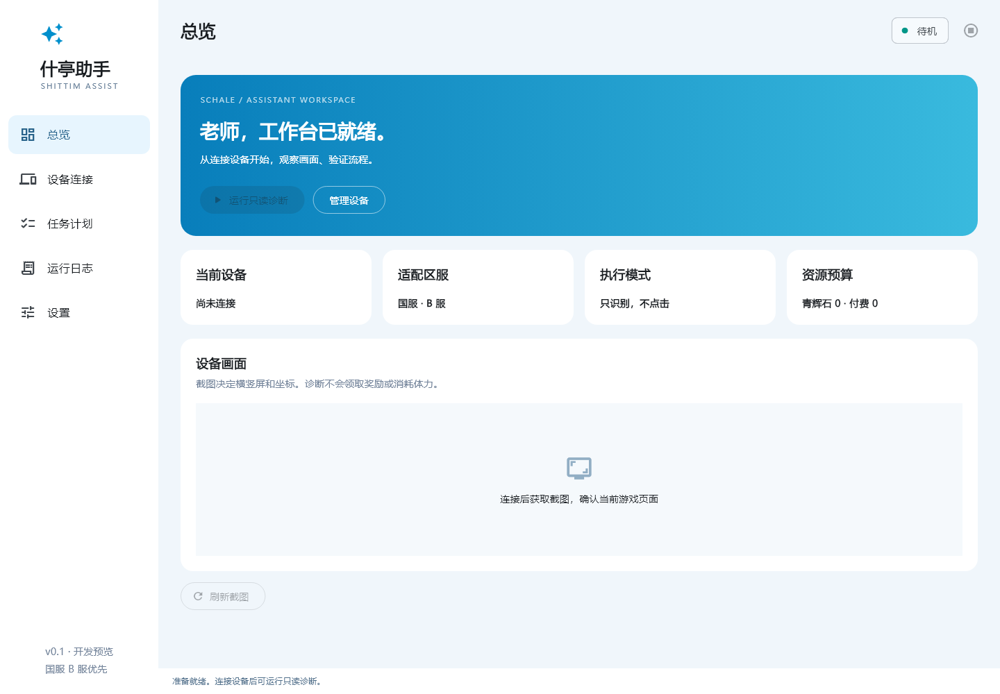
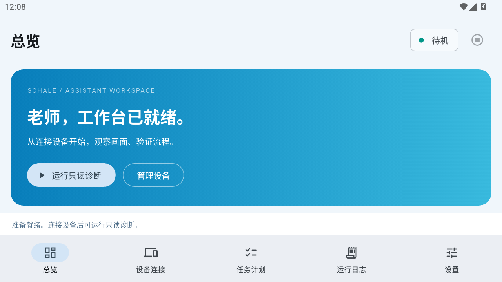

# Shittim Assist · 什亭助手

面向《蔚蓝档案》的 Windows / Android 自动化工作台。名字取自「什亭之匣」，希望帮助老师处理重复事务。

[GitHub 仓库](https://github.com/admin-ulala/shittim-assist) · [自动构建](https://github.com/admin-ulala/shittim-assist/actions)

**当前为 0.1 开发预览：基础设施已实现，国服 B 服日常仍在适配，暂不能一键清日常。**

## 已有能力

- Flutter 自适应界面：总览、设备、任务计划、日志、设置。
- PC：USB/模拟器 ADB 列表、网络连接、无线配对、截图、点击、滑动与返回 API。
- Android：MediaProjection 采集、通知停止、无障碍手势及前台包名桥接源码。
- 引擎：设备互斥、暂停、取消、超时检查、有限只读重试、输入前前台校验。
- 识别：独立 Dart 模板匹配参考实现，支持 ROI 与置信度门槛。
- 配置：JSON 校验、版本字段、导入导出、任务选择与资源预算。
- 日志：JSONL、滚动清理、搜索、凭据脱敏、诊断事件导出。

领奖、签到、扫荡仅有计划配置，没有可执行的游戏任务。OCR、OpenCV、主线、多区服流程、调度与伴侣连接尚未实现。完整状态见 [STATUS](docs/STATUS.md)。

## 开发运行

基线：Flutter **3.47.4** / Dart **3.13.3**。目标 Windows 10/11 x64、Android 11+。

```sh
flutter pub get
flutter analyze
flutter test
flutter run -d windows
```

Windows 构建需 Visual Studio 的 Desktop development with C++ 工作负载及 Windows SDK。Android 构建需 Android SDK 与兼容 Gradle 的 JDK（CI 使用 JDK 21）。

```sh
flutter doctor -v
flutter build apk --debug
```

Android 正式签名未配置。CI 仅生成 debug APK，不是正式发布包。

### PC 诊断

1. 在设备页填写 ADB 路径，扫描或输入主机:端口连接。
2. 同一模拟器多个地址只选择一个。
3. 在设备打开国服 B 服，返回总览运行「只读诊断」。
4. 检查真实截图和日志；诊断不发送点击或消耗资源。

无线调试配对端口与连接端口通常不同，需要支持 `adb pair` 的 ADB。

### Android 本机模式

在设备页开启无障碍并授权屏幕采集。采集使用完整屏幕以保持手势坐标一致；通知提供停止入口。

**当前没有悬浮任务面板和后台流程宿主。** 本机模式用于服务联调，不能宣称已支持离开工作台后自动清日常。APK 已在 CI 编译通过，系统授权和手势仍待实机验证。

**0.1.1** Windows ZIP 与 Android debug APK 可从[成功构建记录](https://github.com/admin-ulala/shittim-assist/actions/runs/35035264060)的 Artifacts 区域下载（GitHub 可能要求登录）。此版修复 Android 冷启动红屏，并已在 MuMu 安装验证。不同 CI 构建的 debug 签名可能不同；测试版本之间可能需要卸载旧助手后安装，会清除助手配置，正式发布前将建立稳定签名。

## 界面

桌面布局渲染预览：



Android 0.1.1 在 MuMu 上实际运行：



## 实机测试（只读）

默认测试不访问设备。显式设置环境变量后运行：

```powershell
$env:SHITTIM_LIVE_ADB = '完整路径\adb.exe'
$env:SHITTIM_LIVE_SERIAL = '127.0.0.1:16416'
flutter test test/live_device_test.dart
```

测试读取前台包名与截图，截图保存在 Git 忽略的 `runtime/`。裁剪匹配仅验证截图管线，不代表页面识别准确率。

## 数据

Windows 数据在 `%LOCALAPPDATA%/ShittimAssist`，Android 在应用私有 files 目录。每份日志约 2 MiB 后滚动，保留当前和上一份。界面截图只存在内存；导出诊断仅包含事件。没有游戏凭据存储、图片上传或青辉石消费入口。

## 文档

- [架构与后续阶段](docs/ARCHITECTURE.md)
- [实现与验证状态](docs/STATUS.md)
- [国服 B 服观察](docs/CN_BILIBILI.md)
- [贡献指南](CONTRIBUTING.md)
- [协作规约](AGENTS.md)
- [第三方声明](THIRD_PARTY_NOTICES.md)

原创代码采用 [MIT](LICENSE)。非官方项目，与游戏开发、发行方无隶属关系；第三方依赖及游戏资产分别适用自己的许可证。

### Android 游戏内悬浮控制（0.1.2）

在「设备连接」依次开启无障碍、授权屏幕采集、开启悬浮控制。切换到国服 B 服，点击「什亭」悬浮球展开面板，再点「开始只读诊断」。悬浮球可拖动；面板支持暂停、继续、停止和关闭。关闭悬浮球会取消任务，屏幕采集可在系统通知中单独停止。

悬浮窗使用无障碍 overlay，无需单独授予“显示在其他应用上层”权限。前台校验会读取窗口根节点包名，不遍历控件文本。截图期间悬浮控件短暂隐藏。应用切到后台仍保留引擎；系统杀进程后需重新打开助手并授权采集。当前可运行的仍只有只读诊断，日常任务尚未实现。

### 悬浮工作台（0.1.3）

悬浮球使用与应用启动图标相同的资源，点击后展开蓝白面板：
- **运行**：只读诊断、暂停/继续、停止、最近日志。
- **任务**：签到、邮件、日常、扫荡的计划选择，以及计划次数、保留体力；这些流程仍待适配。
- **配置**：只识别模式、超时、客户端；数字按钮长按可调整 10。

面板修改立即同步主界面并保存；主界面的当前修改也会同步到悬浮面板。任务执行期间锁定配置。顶栏可拖动，横线收起为图标，关闭按钮取消任务并移除悬浮窗。ADB 与配置文件导入导出继续在主界面操作。
